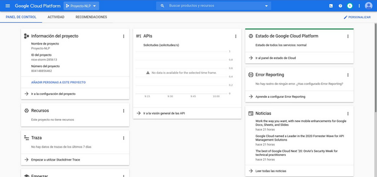
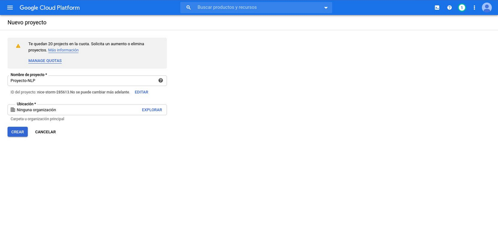
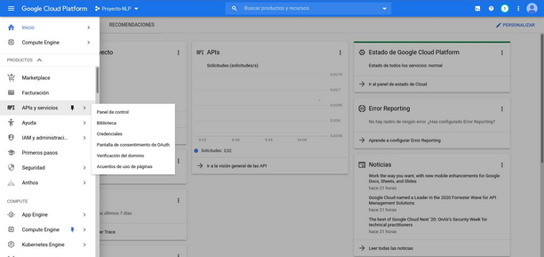
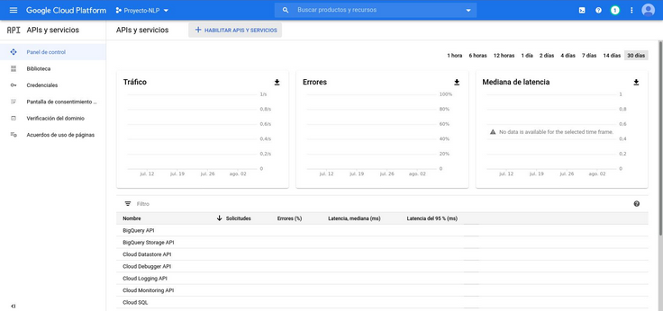
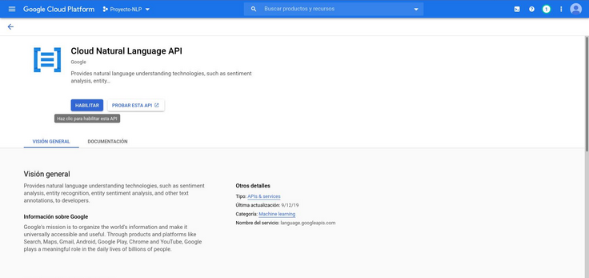
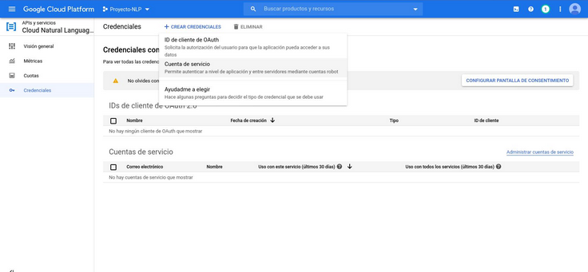
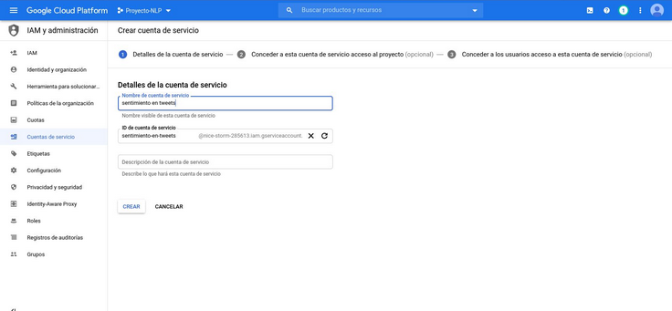
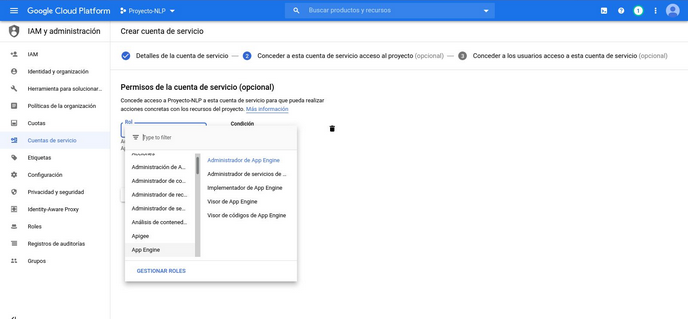
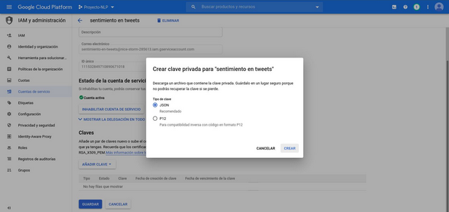
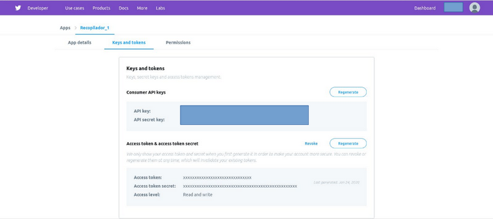

<p>
  <a href="https://www.linkedin.com/in/bhargavsonvane/" target="_blank">
   
 </a>
  <a href="https://opensource.org/licenses/MIT" target="_blank">
   
 </a>
</p>

# Sentiment Analysis in Tweets

In this project, we are going to see how we can perform Sentiment analysis on Tweets without having to have advanced knowledge of NLP techniques.

**IMPORTANT NOTE:** In this project we are going to use a free layer of the Goggle Cloud Platform (GCP) text analysis service. How to request access to the respective API and use it for the required purpose will be briefly explained. However, it is recommended that each step taken during the configuration of this service be done in a conscious way, since failure to do so may incur unplanned costs.


## Requirements

- Python> = 3.4
- Account in GCP.
- Developer account on Twitter.


### GCP account

If it is the first time that we configure it, Google will give us 300 USD in credits for free to be used in 12 months.

Once the account is created, we enter the GCP console . If it is the first time that we use it, it will ask us for a series of data, including information about a Credit Card. Since the Terms of Service can change at any time, I recommend reading them carefully . Currently they indicate that they only require that information to verify the account and so that there is a means of collection in case expenses are incurred.

#### Creation of the Project in GCP

Once inside the console, the dashboard will be shown where a summary of the services that we have active will appear, if it is the first time you use it, it will surely not have much information.

<p align="center">

</p>

A project in GCP is nothing more than a way to manage the services that we want to incorporate centrally. Projects allow you to control expenses and access authorizations to services that are configured within GCP. In order to use any service it is necessary to create a project.

<p align="center">

</p>


#### Activating the NLP Service and obtaining permission key in GCP

To use the Cloud Natural Language API in our application, we must activate said API within the project and obtain an access key in JSON format, this procedure is detailed in the following images:

<p align="center">

</p>

<p align="center">

</p>

When activating the API, it asks to be linked to the billing account.

<p align="center">

</p>

Now, we obtain the credentials in json format that will allow us to connect to the NLP service of our project:

<p align="center">

</p>

We now need to create a service account, which can have any name:

<p align="center">

</p>

We continue configuring it as indicated and we get the json file:

<p align="center">

</p>

<p align="center">

</p>

### Twitter Developers account

Since the interest of the application is not only sentiment analysis, but that these come from Twitter, we must have an account on [Twitter Developers](https://developer.twitter.com/en).

This step is perhaps the one that takes the most time, since accessing the Twitter API requires creating an App within the Twitter Developers account, and for this we must fill out a record where we expose the use that we will give to said application.

Once the creation of the App is authorized, we can navigate to its  [details](https://developer.twitter.com/en/apps). There we look at the Keys and Tokens tab, if necessary, click on the “Create” button in “Access token & access token secret”.

<p align="center">

</p>

Create a json file with the following structure:

Keys.json:

```
{
    "Access_token":"Twitter-Access-Token",
    "Access_token secret":"Twitter-Access-Token-Secret",
    "API_key":"Twitter-API-Key",
    "API_secret key":"Twitter-API-Secret Key"
}
```

Once you have this file, you have everything you need to test the application.
## Testing the application

To verify that everything works correctly, a file is included that can be run on the command line and observe the results.

The steps to follow are those:

### Clone this repository

```
git clone https://github.com/bhargavsonvane/twittersentiment-nlpai.git
cd twittersentiment-nlpai
```

### Create Python Virtual Environment and Install Dependencies

```
python3 -m venv <virtualenvname>
```

In my case, <any name> is "virtualenvname".

```
source virtualenvname/bin/activate
pip3 install -r requirements.txt
```

### Set Google environment variable

Run at the command line:

```
export GOOGLE_APPLICATION_CREDENTIALS=<path-to-gcp-credential-file.json>
```

<path-to-gcp-credential-file.json> is the file that we downloaded with the Google credentials.

**Note:** This may be different for Windows Operating Systems, in my case I am on Ubuntu but it should work in the same way for Mac environments.

### Run test file

```
python3 application.py -q NLP
```

You can replace "NLP" with any other search query of interest, if it is more than one word it should be used in double quotes: "Machine Learning".
